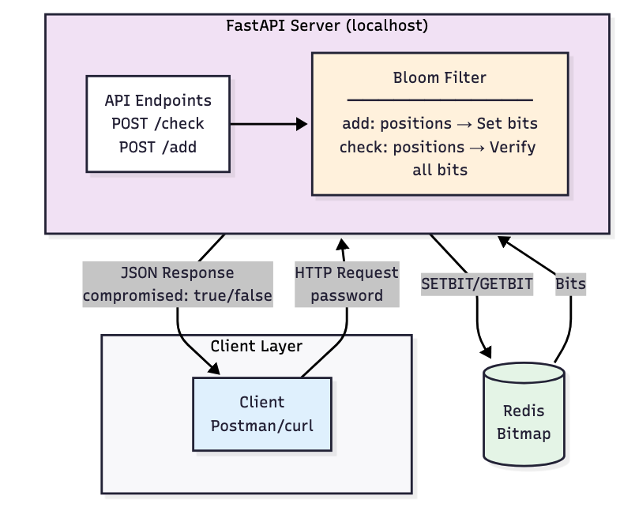
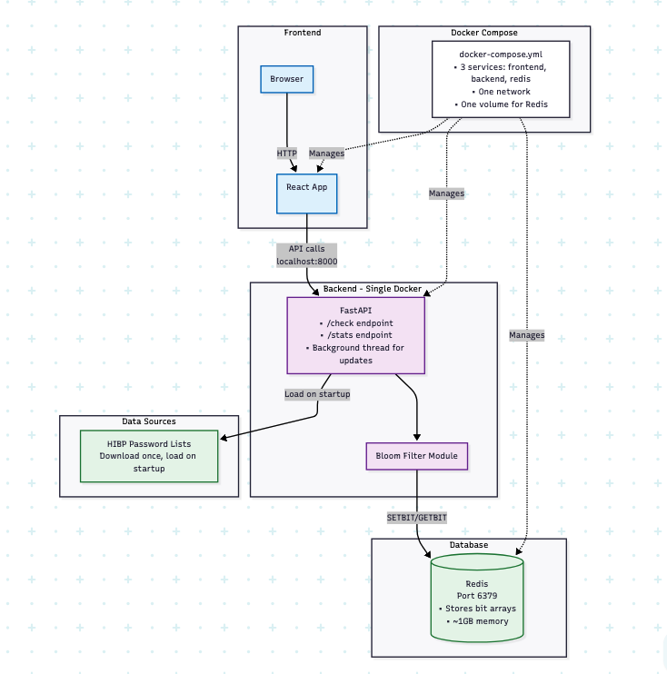

# Password Validator using Bloom Filter (and Redis)

Hihg performance API for checking if passwords have been compromised in data breaches, using Redis-backed Bloom filters

- **Space Efficient**: metrics to be added*
- **Fast Lookups**: metrics to be added*
- **Low False Positive Rate**: Configurable accuracy (default 0.1% FP rate)
- **Privacy Focused**: Never stores actual passwords, only hashes

### how it works

1. **Optimal size calculation** - uses math formulas to determine the ideal bit array size and # of hash functions, based on expected items & desired FP rate
2. **Double hashing** - instead of k independent hash functions, use 2 base hashes to generate k positions
	- We get hash count with following formula
		- k = (m/n) * ln(2)
		- (https://en.wikipedia.org/wiki/Bloom_filter#Optimal_number_of_hash_functions)
	- using k hash functions is expensive, so we use 2 base hashes to generate k positions
		- g(x) = h1(x) + i * h2(x) 
		- https://www.eecs.harvard.edu/~michaelm/postscripts/rsa2008.pdf
3. **Redis persistence** - stores bit array in REdis using SETBIT & GETBIT operations for fast & persisten access

### What i've learned about Bloom filters
- Bloom filter is a probablistic data structure that tells you one of 2 things:
	1) data is DEFINITELY not in set --> if any bit is 0, item was never added
	2) data is POSSIBLY in set --> if all bits are 1, item might have been added

- for password checking this is okay because:
	- false positives are acceptable  (we're better safe than sorry here)
	- false negatives never occur (will never miss a breached password)

### Current Architecture

### Proposed Architecture (in progress)

